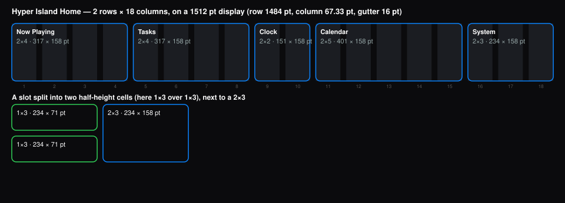

# Widget sizes — the grid

Every widget on the island has a size in **grid spans**, rows × columns, the way phone widgets do: a `2x4` widget is full height and four columns wide, and a `1x3` is half height and three wide. You design for spans. The island measures them in points on whatever display it's on, and tells your widget both.

*Generated from the island's own layout code, not written by hand.*



## The grid

- **Hyper Island's Home row: 2 rows × 18 columns**, with 16 pt gutters between columns and between rows.
- **Rows are fixed:** 2 rows = **158 pt** (full height) and 1 row = **71 pt** (half height), on every display.
- **Columns scale with the display.** One column is (row − 17 × 16) ÷ 18, where the row is the display width minus 28 pt. A span of *c* columns is *c* columns plus (*c* − 1) gutters, rounded to the point.
- **Slots:** a slot is a run of columns holding either one full-height widget or two half-height ones, one above the other. Picking a half-height widget for a whole slot splits it.
- **Fitting:** a widget fits a cell of the same height that's at least as wide as one of its `sizes`, and stretches to fill it. List every size you support, smallest first.

## Column width by display

| Display (pt) | Home row | One column |
|---|---:|---:|
| 1440 (13" MacBook Air, older) | 1412 pt | 63.33 pt |
| 1470 (13" MacBook Air) | 1442 pt | 65.00 pt |
| 1512 (14" MacBook Pro) | 1484 pt | 67.33 pt |
| 1710 (15" MacBook Air) | 1682 pt | 78.33 pt |
| 1728 (16" MacBook Pro) | 1700 pt | 79.33 pt |
| 1920 (1080p display) | 1892 pt | 90.00 pt |
| 2560 (1440p / 5K display) | 2532 pt | 125.56 pt |

## Span widths (points)

The height is **158 pt** for 2 rows and **71 pt** for 1 row. Widths:

| Columns | 1440 | 1470 | 1512 | 1710 | 1728 | 1920 | 2560 |
|---:|---:|---:|---:|---:|---:|---:|---:|
| 1 | 63 | 65 | 67 | 78 | 79 | 90 | 126 |
| 2 | 143 | 146 | 151 | 173 | 175 | 196 | 267 |
| 3 | 222 | 227 | 234 | 267 | 270 | 302 | 409 |
| 4 | 301 | 308 | 317 | 361 | 365 | 408 | 550 |
| 5 | 381 | 389 | 401 | 456 | 461 | 514 | 692 |
| 6 | 460 | 470 | 484 | 550 | 556 | 620 | 833 |
| 7 | 539 | 551 | 567 | 644 | 651 | 726 | 975 |
| 8 | 619 | 632 | 651 | 739 | 747 | 832 | 1116 |
| 9 | 698 | 713 | 734 | 833 | 842 | 938 | 1258 |
| 10 | 777 | 794 | 817 | 927 | 937 | 1044 | 1400 |
| 11 | 857 | 875 | 901 | 1022 | 1033 | 1150 | 1541 |
| 12 | 936 | 956 | 984 | 1116 | 1128 | 1256 | 1683 |
| 13 | 1015 | 1037 | 1067 | 1210 | 1223 | 1362 | 1824 |
| 14 | 1095 | 1118 | 1151 | 1305 | 1319 | 1468 | 1966 |
| 15 | 1174 | 1199 | 1234 | 1399 | 1414 | 1574 | 2107 |
| 16 | 1253 | 1280 | 1317 | 1493 | 1509 | 1680 | 2249 |
| 17 | 1333 | 1361 | 1401 | 1588 | 1605 | 1786 | 2390 |
| 18 | 1412 | 1442 | 1484 | 1682 | 1700 | 1892 | 2532 |

## Common sizes on a 14" MacBook Pro (1512 pt)

| Size | Points | Good for |
|---|---|---|
| 1×2 | 151 × 71 | a number or a status, with one icon button |
| 1×3 | 234 × 71 | one line: a count, a label, a button |
| 1×4 | 317 × 71 | a line with room for a title |
| 2×2 | 151 × 158 | a single figure (the clock's size) |
| 2×3 | 234 × 158 | a small card: a title, a figure, a meter |
| 2×4 | 317 × 158 | a card with a list or controls (Tasks, Now Playing) |
| 2×5 | 401 × 158 | a card with two parts side by side (Calendar) |
| 2×6 | 484 × 158 | a wide card: a chart and its legend |

## Inside a card

- **Padding:** 12 pt on every side, so a 2-row card has 134 pt of content height and a 1-row card 47 pt. A card with a title spends about 20 pt of that on its header.
- **Corner radius:** 12 pt by default. It follows the user's corner-radius setting (the island's radius − 14), so don't draw corners of your own.
- **Text:**
  - `title` 18 pt bold
  - `body` 12 pt medium
  - `caption` 10.5 pt medium at 50% white
  - `mono` 12 pt with tabular digits
- **Icons:** any Lucide name, 8–28 pt (14 by default). Buttons use 12 pt.
- **Colours:**
  - Primary buttons use the user's accent colour, and `style: "secondary"` gives a quieter one.
  - Text is white at 85–100%, and captions at 50%.
  - The card background is the island's own (frosted or dark), never yours.

## In the manifest

```json
"widgets": [{ "id": "streak", "title": "Streak", "icon": "glass-water", "sizes": ["2x3", "1x3"], "refresh": "60s" }]
```

## In your code

`render(ctx)` gets `ctx.size`:

```js
{ rows: 1, columns: 3, label: "1×3", width: 234, height: 71, class: "regular" }
```

- `class` is a hint: `compact` (1–2 columns), `regular` (3–4) or `wide` (5 or more).
- The same widget can be on screen in different cells at once, and each is rendered at its own size.
- The sample `samples/plugins/hydration-streak` draws a full card at 2 rows and a single line at 1 row.

## Tips

- **A 1-row card** has 47 pt for content: one line. Put `ui.spacer()` before and after a single row to centre it.
- **Stretching:** a widget fits any cell of the same height that's at least as wide as a size it lists. Lay it out to stretch, with `ui.spacer()` between the ends of a row, rather than for exact points.
- **Narrow cells:** use `ctx.size.columns` or `ctx.size.class` to drop words before they truncate. The sample shows "Log a glass" at 4 columns and up, and just the + below that.

## Checking your widget

- **In the app:** in edit mode (the pencil in the island's top-right icons), each cell's span is shown on its outline. Put your widget in cells of each size you list; the Half height group splits a slot into two 1-row cells.
- **Pictures:** `hi render <folder> --png` has the island draw it at every size it lists, into the plugin's `previews/`: the pictures edit mode's picker shows. `ctx.preview` is true while it draws them, so show sample content.
